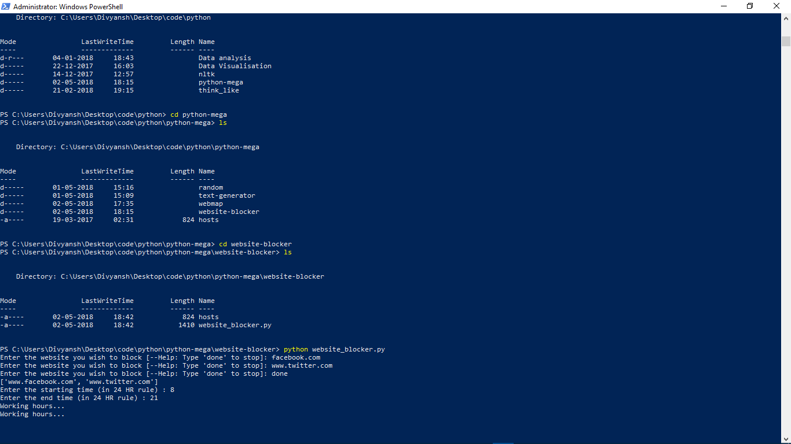
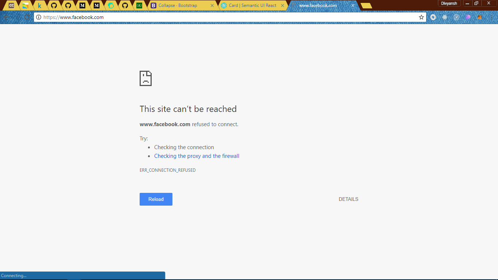
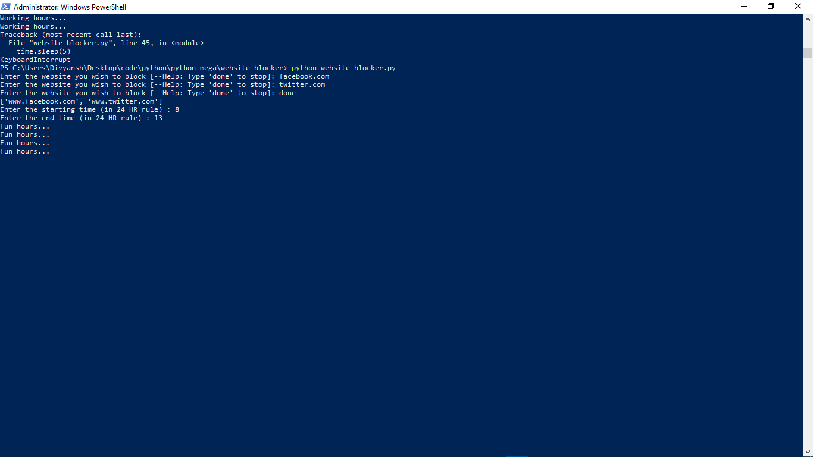
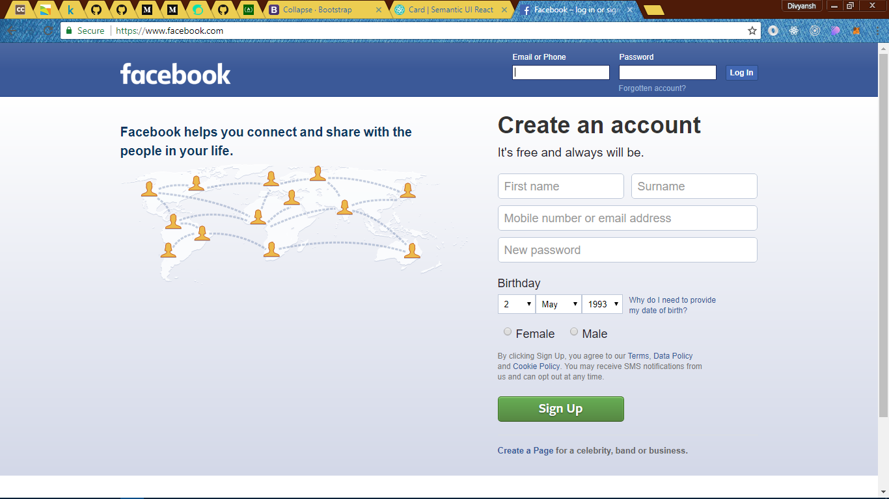

# Website-Blocker

A Website blocker made in python with time scheduling capabilities.

## Getting Started

* Clone the repo.
* run website_blocker.pyw

### Prerequisites

What things you need to install the software and how to install them

* Python 3

## Built With

* [Python3](https://www.python.org) - The programming language

## Authors

* **Divyansh Dwivedi** - *Initial work*

## Screenshot

